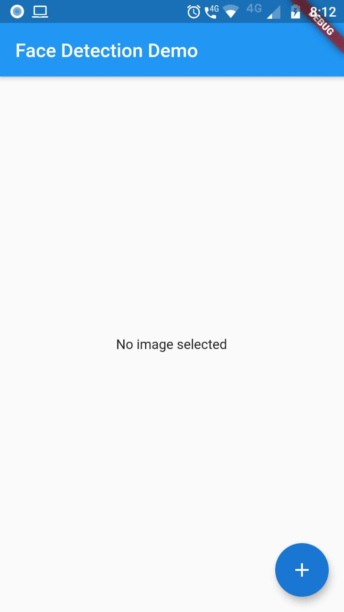
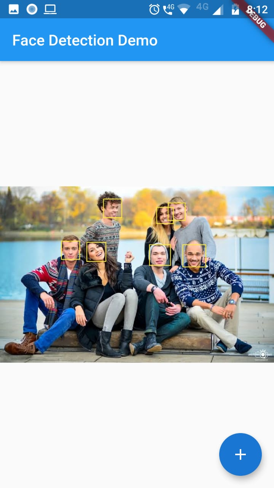

# flutter_face_detection_app

A new Flutter application to detect faces using ml kit.

## Getting Started

This project is a starting point for a Flutter application.

A few resources to get you started if this is your first Flutter project:

- [Lab: Write your first Flutter app](https://flutter.dev/docs/get-started/codelab)
- [Cookbook: Useful Flutter samples](https://flutter.dev/docs/cookbook)

For help getting started with Flutter, view our
[online documentation](https://flutter.dev/docs), which offers tutorials,
samples, guidance on mobile development, and a full API reference.


# Flutter - Face Detection using ML kit

Hi! in this project **google ML kit** is used to detect faces from the image.

# Dependencies

- [ImagePicker](https://pub.dev/packages/image_picker) - to pick image from gallery or from camera,
- [ML kit](https://pub.dev/packages/firebase_ml_vision) - A Flutter plugin to use the [ML Kit Vision for Firebase API](https://firebase.google.com/docs/ml-kit/).
- [Floating action button list](https://pub.dartlang.org/packages/unicorndial) - shows floating button list on floating button clicked.

## Implementation [Android]

**Step-1 :** Create new firebase app to create google-services.json for android and iOS projects and place the file as suggested by firebase [refer docs](https://firebase.google.com/docs/flutter/setup).
**Step-2:** Add dependencies to flutter projects and get the dependencies.
**Step-3:** Add ```api 'com.google.firebase:firebase-ml-vision-face-model:17.0.2'``` to app level build.gradle file in android -> dependencies.
**Step-4:** Make sure to add ```apply plugin: 'com.google.gms.google-services'``` in app build.gradle at end of file and ```classpath 'com.google.gms:google-services:3.2.1'``` in project level build.gradle
**Step-5:** Build and run the project

## Implementation [iOS]

Not yet implemented will update soon.

All your files and folders are presented as a tree in the file explorer. You can switch from one to another by clicking a file in the tree.

## How it works
- Pick image from gallery/camera using image picker
- Get Faces from choosen image from firebase vision face detector.
- The face detector will return a list of Face class which contains the Rect coordinates.
- The Painter will then use these coordinates to draw a rectangular box around the faces using these coordinates.
- full source code available at ```lib/main.dart```.

## Sample Screens


